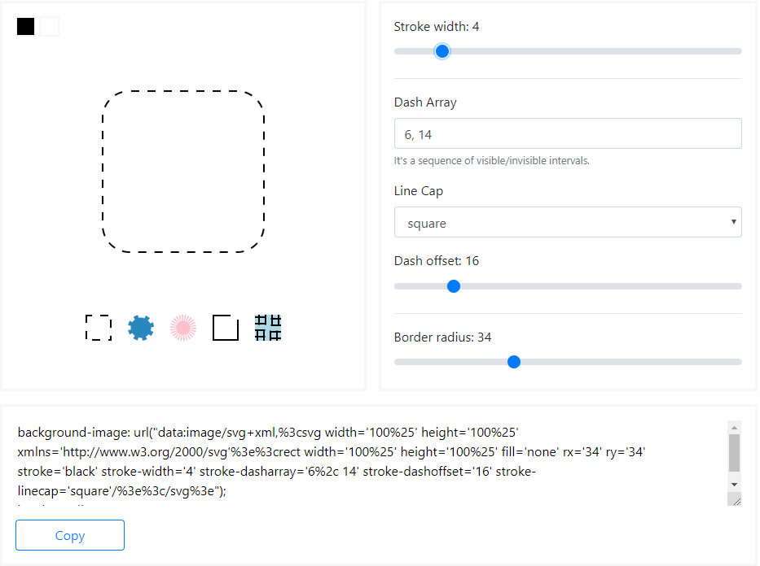

# Dashed Border Generator
A simple online tool for creating custom dashed or dotted borders. Using CSS hack, this tool can simply increase space between dots, change dash length or distance between strokes.

## How does it work? 🚀
Native CSS properties **don't support** the customization of `border-style`. 
Therefore, we use a trick with an ***SVG image inside*** `background-image` property. 
The SVG features give us the ability to change the distance between dashed lines, set custom pattern, add dash offset or even change a line cap. 

Generated SVG image is vector and it fills width and height of elements by 100%, so it doesn't matter what size elements have.

## [View in Action](http://kovart.github.io/dashed-border-generator/)

## Dependencies
* [VueJS](https://github.com/vuejs/vue)
* [Bootstrap 4](https://github.com/twbs/bootstrap)
* [vue-color](https://github.com/xiaokaike/vue-color)
* [mini-svg-data-uri](https://github.com/tigt/mini-svg-data-uri)

## License
[The MIT License](http://opensource.org/licenses/MIT)

Copyright (c) 2019-present, Artem Kovalchuk
